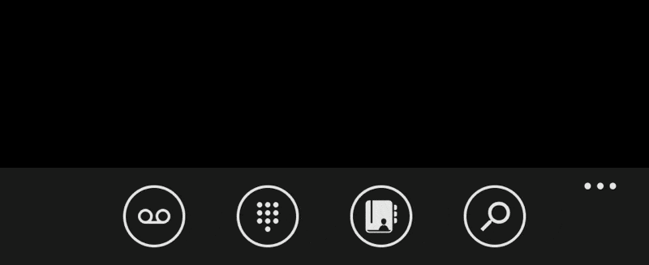

# App Bar (disco-app-bar)

The app bar provides a compact, fixed footer with icon buttons, labels, and menu items.



## Template-Based Usage

App bars are defined as templates. The page clones the active template into a footer host.

### Single Page (Global App Bar)

```html
<disco-single-page>
  <template data-appbar-global>
    <disco-app-bar mode="compact" opacity="0.9">
      <disco-app-bar-icon-button icon="search" label="search"></disco-app-bar-icon-button>
      <disco-app-bar-menu-item label="settings"></disco-app-bar-menu-item>
    </disco-app-bar>
  </template>
</disco-single-page>
```

### Pivot Item Override

```html
<disco-pivot-page>
  <template data-appbar-global>
    <disco-app-bar mode="compact">
      <disco-app-bar-menu-item label="global option"></disco-app-bar-menu-item>
    </disco-app-bar>
  </template>

  <disco-pivot-item header="photos">
    <template data-appbar>
      <disco-app-bar mode="compact">
        <disco-app-bar-icon-button icon="camera" label="camera"></disco-app-bar-icon-button>
      </disco-app-bar>
    </template>
    <disco-list-view>...</disco-list-view>
  </disco-pivot-item>
</disco-pivot-page>
```

### Hub Section Override

```html
<disco-hub-page>
  <template data-appbar-global>
    <disco-app-bar mode="compact">
      <disco-app-bar-menu-item label="global option"></disco-app-bar-menu-item>
    </disco-app-bar>
  </template>

  <disco-hub-section header="camera">
    <template data-appbar>
      <disco-app-bar mode="compact">
        <disco-app-bar-icon-button icon="camera" label="camera"></disco-app-bar-icon-button>
      </disco-app-bar>
    </template>
    <!-- section content -->
  </disco-hub-section>
</disco-hub-page>
```

## Components

### disco-app-bar

Attributes:
- `mode`: `compact` or `expanded` (default: `compact`).
- `opacity`: Set bar opacity (e.g., `0.9`).

Slots:
- `icons`: `disco-app-bar-icon-button` items.
- `menu`: `disco-app-bar-menu-item` items.

Behavior:
- Icon labels appear when the ellipsis menu is expanded.
- Menu items are shown under the icons when expanded.

### disco-app-bar-icon-button

Attributes:
- `icon`: Icon name (mapped to `mif-${icon}`).
- `label`: Accessible label shown in the menu.
- `disabled`: Disabled state.

Example:

```html
<disco-app-bar-icon-button icon="search" label="search"></disco-app-bar-icon-button>
```

### disco-app-bar-menu-item

Attributes:
- `label`: Menu item label.
- `disabled`: Disabled state.

Example:

```html
<disco-app-bar-menu-item label="settings"></disco-app-bar-menu-item>
```
