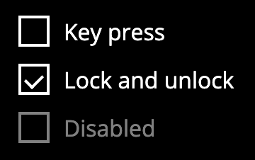

# DiscoCheckbox (`<disco-checkbox>`)

A binary option toggle.



## Usage

```html
<disco-checkbox checked>Enable Wi-Fi</disco-checkbox>
```

## Attributes

- `checked`: Boolean attribute. If present, the box is checked.
- `disabled`: Disables interaction.

## Properties

- `checked` (`boolean`): Get or set the state.

## Events

- `change`: Fired when the `checked` state changes due to user interaction.
