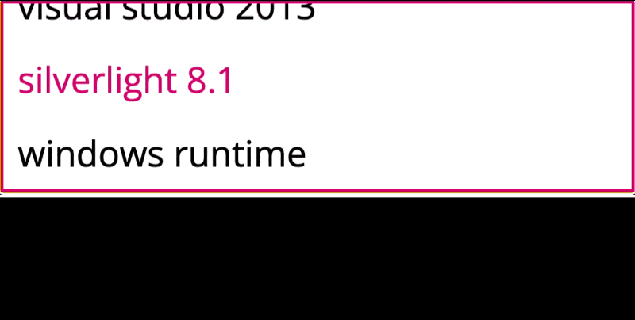

# DiscoComboBox (`<disco-combo-box>`)

A Metro-style combo box for picking from a short list of options.



## Usage

```html
<disco-combo-box>
    <disco-combo-box-item value="1">Visual Studio 2013</disco-combo-box-item>
    <disco-combo-box-item value="2" selected>Silverlight 8.1</disco-combo-box-item>
    <disco-combo-box-item value="3">Windows Runtime</disco-combo-box-item>
    <disco-combo-box-item value="4">XAML Debugger</disco-combo-box-item>
</disco-combo-box>
```

## Attributes

- `open`: Whether the combo box is expanded.
- `value`: The selected value (mirrors the selected item).

## Properties

- `selectedIndex` (`number`): Selected item index.
- `value` (`string`): Selected item value.

## Events

- `change`: Fired when the selection changes. `event.detail` includes `index`, `value`, and `item`.

## Child Components

### `<disco-combo-box-item>`

- `value`: Value string for the option.
- `selected`: Marks the item as initially selected.
