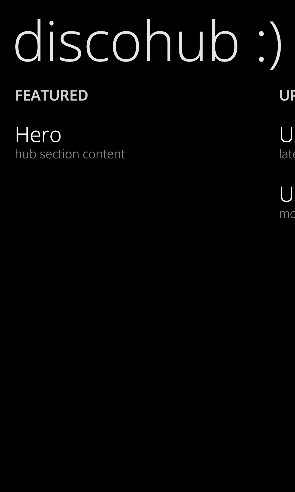

# DiscoHub (`<disco-hub>`)

A container for "Hub" experiences, featuring a large panoramic background, a large header title, and horizontally scrolling sections.



## Usage

```html
<disco-hub header="Store" background="assets/background.jpg">
    <disco-hub-section header="highlight" width="400px">
        <!-- content -->
    </disco-hub-section>
    <disco-hub-section header="apps" width="320px">
        <!-- content -->
    </disco-hub-section>
</disco-hub>
```

## Attributes

### `<disco-hub>`
- `header`: The large title displayed at the top left.
- `background`: URL to the background image. The hub applies a parallax effect to this image during horizontal scrolling.

### `<disco-hub-section>`
- `header`: The title of the section.
- `width`: CSS width of the section (e.g., `400px`, `100vw`). Defaults to auto-sizing based on content if not set, but explicit width is recommended for layout stability.

## App Bar Overrides

Add a `template[data-appbar]` inside a hub section to override the global app bar for that section.

```html
<disco-hub-section header="camera">
    <template data-appbar>
        <disco-app-bar mode="compact">
            <disco-app-bar-icon-button icon="camera" label="camera"></disco-app-bar-icon-button>
        </disco-app-bar>
    </template>
    <!-- section content -->
</disco-hub-section>
```
