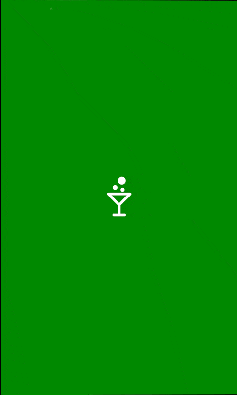

# DiscoSplash (`<disco-splash>`)

An overlay shown during application startup.



## Usage

Typically initialized via `DiscoApp` options, but can be customized.

```javascript
new DiscoApp({
    splash: {
        mode: 'auto',
        color: '#1a1a1a',
        icon: 'assets/logo.png',
        showProgress: true,
        progressColor: '#ffffff'
    }
});
```

If used manually:

```html
<disco-splash logo="assets/logo.png"></disco-splash>
```

## Attributes

- `logo`: URL to the logo image displayed in the center.
- `color`: Optional background color for the splash.
- `show-progress`: If present, shows the indeterminate progress bar at the top of the splash.
- `progress-color`: Sets the progress bar accent color. Defaults to white.

## Behavior

- The splash uses the **splash-in** animation set on startup (page-in with perspective).
- `dismiss()` runs a fast fade-out animation and removes the splash from the DOM.

## API

### On `DiscoApp`

- `setupSplash()`: Marks the splash as ready to dismiss (setup complete).
- `dismissSplash()`: Marks the splash as ready to dismiss (data/ready complete).

### On `<disco-splash>`

- `dismiss()`: Starts the fade-out animation and removes the splash screen from the DOM.
