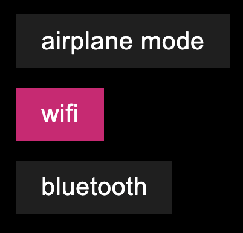

# DiscoToggleButton (`<disco-toggle-button>`)

Displays an on/off toggle state as a button.



## Usage

```html
<disco-toggle-button>Airplane Mode</disco-toggle-button>
<disco-toggle-button checked>Wi-Fi</disco-toggle-button>
```

## API

### Properties
- `checked` (`boolean`): Current on/off state.
- `disabled` (`boolean`): Disables interaction.

### Attributes
- `checked`
- `disabled`

### Events
- `change`: Fired when checked state changes.
